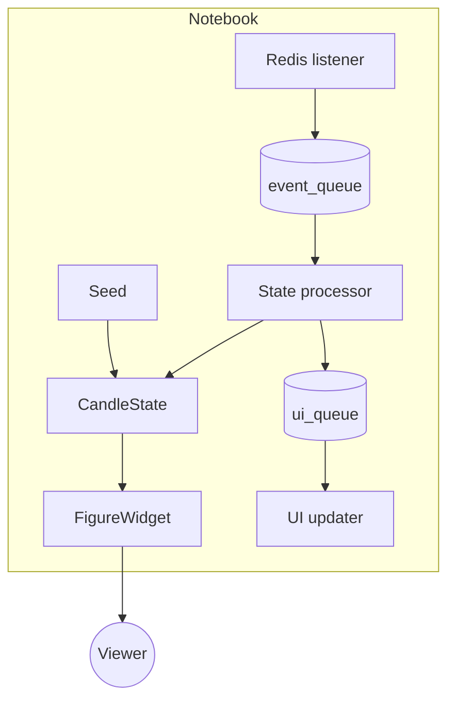
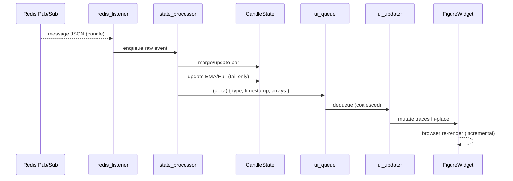

# Real-Time Notebook Plot Enhancement Proposal

## 1. Objective
Enable the existing `src/devtools/playground_charts.ipynb` notebook to display *continuously updating* MACD + Hull candlestick charts for a symbol/interval using **only current infrastructure** (Redis Pub/Sub + InfluxDB). Avoid architectural refactors or new backend services.

## 2. Scope
In-scope:
- Real-time updates for a single symbol + interval (e.g. `SPY{=m}`) with optional parallel secondary interval (`5m`).
- Incremental candle + indicator refresh (MACD, Hull / existing plot helper functions) using Plotly in Jupyter.
- Lightweight asyncio tasks inside the notebook: Redis subscription listener, state processor, UI updater.
- Efficient indicator maintenance (incremental EMA update for MACD; Hull recomputed only for tail if feasible).

Out-of-scope (explicit non-goals now):
- New FastAPI/WebSocket endpoints.
- Kafka integration.
- Cross-notebook shared snapshot service.
- Generic plugin architecture.
- Persisted indicator deltas (Influx writes) beyond what already exists.

## 3. Baseline Today
- Historical candles fetched via `MarketDataProvider.streamer.download()` (Influx-backed).
- Indicators computed in batch then rendered via `plot_macd_with_hull` → static figure.
- Redis already carries live candle events (`market:CandleEvent:<SYMBOL>:<INTERVAL>` assumed pattern).

## 4. Minimal Real-Time Layer (Notebook-Local)
Three cooperative asyncio tasks plus shared state:
1. `redis_listener` — subscribes to Redis pattern/topic; enqueues raw JSON events.
2. `state_processor` — dequeues events, normalizes/merges into in-memory candle series + updates MACD/Hull incremental state; pushes condensed UI update messages.
3. `ui_updater` — throttled application of mutations to a `plotly.graph_objects.FigureWidget` (mutating trace arrays in-place).

Shared objects:
- `CandleState` (stores polars DataFrame and rolling indicator state).
- `asyncio.Queue` (raw events) & `asyncio.Queue` (ui updates) for decoupling.

## 5. Component Overview


## 6. Data & Control Sequence (New Candle Scenario)


## 7. Candle & Indicator Update Logic
### Candle Merge Rules

| Condition | Action |
|-----------|--------|
| incoming.timestamp == last.timestamp | In-place mutation: high=max, low=min, close=close, volume=accumulate |
| incoming.timestamp > last.timestamp  | Append new bar |
| incoming.timestamp < last.timestamp  | Ignore (late/out-of-order) unless gap detected |

### Gap Detection
If `incoming.timestamp > last.timestamp + interval`: fetch missing range via `streamer.download` (bounded to small window) before applying new bar.

### Incremental MACD (avoid full recompute)
Store previous `fast_ema`, `slow_ema`, `signal`:
```
alpha_fast  = 2 / (fast_len + 1)
alpha_slow  = 2 / (slow_len + 1)
alpha_signal= 2 / (signal_len + 1)
fast_ema_t  = alpha_fast*close + (1-alpha_fast)*fast_ema_prev
slow_ema_t  = alpha_slow*close + (1-alpha_slow)*slow_ema_prev
macd_line   = fast_ema_t - slow_ema_t
signal_t    = alpha_signal*macd_line + (1-alpha_signal)*signal_prev
hist_t      = macd_line - signal_t
```
Initialization: derive from seeded historical frame once.

### Hull MA
If performance is acceptable (< 1 ms for dataset size), recompute final window each new bar. Else maintain rolling WMA buffers.

## 8. UI Update Strategy
- Use `FigureWidget` (not static `Figure`).
- Keep references to underlying trace arrays (candlestick: open/high/low/close/x; MACD lines; histogram; hull line).
- Coalesce updates: `ui_updater` wakes every 300ms; applies last pending mutation(s).
- Immediate flush override when a bar closes (timestamp advance) to keep session transitions crisp.

## 9. Proposed Notebook Cell Additions (High-Level)

| Cell | Purpose |
|------|---------|
| New Markdown | Real-time section header + instructions |
| Helper Code  | CandleState class + indicator incremental logic |
| Redis Setup  | Async connection + subscribe channel name builder |
| Tasks Start  | Launch listener / processor / ui tasks |
| Figure Init  | Seed historical + build FigureWidget |
| Live Display | Show widget + status (active symbol/interval, last ts) |
| Stop Function | `stop_realtime()` to cancel tasks & close Redis |

## 10. Incremental Delivery Plan

| Step | Deliverable | Acceptance Test |
|------|-------------|-----------------|
| 1 | Replace static chart with `FigureWidget` seeded from history | Manual: figure renders identical visually |
| 2 | Add Redis listener printing raw events | Message log increments on live feed |
| 3 | Introduce state_processor merging candles (no indicators) | OHLC updates in-place mid-bar |
| 4 | Add incremental MACD & Hull updates | MACD lines move without full flicker |
| 5 | Add throttled ui_updater (coalescing) | CPU in notebook stable; no backlog |
| 6 | Add gap backfill logic | Force skip → missing bar auto-fetched |
| 7 | Add stop routine & cleanup validation | Post-stop: no new updates for 30s |

## 11. Risk & Mitigations

| Risk | Likelihood | Mitigation |
|------|------------|------------|
| Event burst overwhelms UI | Medium | Coalesce + throttle queue |
| Out-of-order / duplicate bars | Medium | Timestamp guard + ignore policy |
| Memory growth (long session) | Low | Soft window limit (slice df to last N bars) |
| MACD drift due to incremental precision | Low | Periodic (hourly) full recompute sanity check |

## 12. Performance Targets
- UI latency (last candle change → visible) < 500 ms (95th percentile).
- Processor queue depth usually ≤ 5.
- CPU overhead negligible (< 10% of single core for one symbol).

## 13. Future (Optional After Success)
- Multi-symbol panel (grid of FigureWidgets or tabbed UI).
- WebSocket backend for browser clients outside notebook.
- Persist indicator deltas to Influx for historical reconstruction.
- Snapshot hash in Redis for instant reload.

## 14. Rollback Strategy
If instability observed: stop tasks, revert to original static cells (retain original static plotting cell untouched or keep a `%run` backup). No persistent schema changes → risk minimal.

## 15. Open Questions
1. Exact Redis channel naming pattern? (Confirm before coding.)
2. Are partial candle update semantics guaranteed (open fixed, high/low mutating)?
3. Required maximum lookback length for initial seed? (Session only vs multi-day.)

## 16. Summary
This proposal adds a *local, notebook-scoped* real-time layer with minimal complexity: three asyncio tasks, a state object, and FigureWidget mutation. It leverages existing Redis + Influx infrastructure, avoids premature refactoring, and provides a clear, testable incremental path.

---
*Ready for review. Once approved, we can generate the exact notebook cell inserts.*
