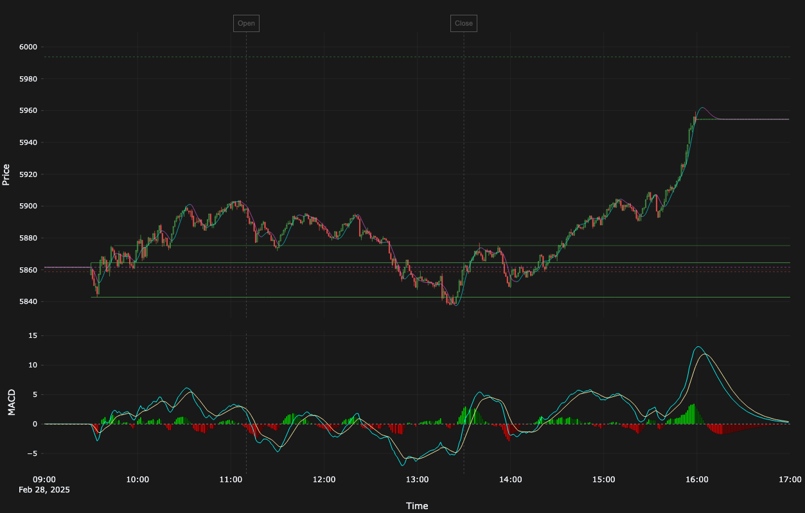

# TastyTrade SDK

A high-performance Python SDK for the TastyTrade Open API, providing programmatic access to trading operations and real-time market data with advanced analytics capabilities.




## 🚀 Features

### Core Trading Features
- Trade execution and position management
- Advanced order types support
- Real-time position monitoring
- Options chain data access
- Risk metrics tracking
- Support for stocks and options (futures and crypto planned)

### 📊 Real-Time Data Processing
- High-performance DXLink client:
  - Handles WebSocket connection management
  - Real-time market data stream processing
  - Event normalization and type safety
  - Advanced subscription management
  - Automatic reconnection and error handling
- Robust data pipeline:
  - Telegraf as data routing backbone:
    - Receives processed events from DXLink client
    - Writes to InfluxDB for time-series storage
    - Streams to Kafka for real-time distribution *(in development)*
    - Provides system metrics and monitoring
  - InfluxDB for historical analysis
  - ~~Kafka~~ Redis for scalable event distribution
- Event processing and analytics:
  - Real-time technical indicators
  - Custom data transformations
  - Configurable event processors
  - Fault-tolerant data flow

### 📈 Analytics

- Real-time technical indicators:
  - Hull Moving Average (HMA)
  - MACD with dynamic color coding
  - Volume analysis (planned)
  - Custom price and time references
- Interactive charting
- Customizable dashboards

### 🔧 Technical Architecture

To aid progressive understanding, this section is layered from the original linear concept → concise responsibilities → detailed flow & realtime specifics. Skim in order; each layer adds resolution.

#### 0. Conceptual Overview (Original Linear Layout)

```text
                                   WebSocket Feed
                                         │
                                    ┌──────────┐  Message Parser
                    ┌───────────────│ DXClient │        &
                    │               └──────────┘   Event Router
                    │                    │
                    │                    ▼
                    │               ┌──────────┐
                    │               │ Telegraf │  ──  ──  ──  ─┐
                    │               └──────────┘
                    │                    │                     │
                    ▼                    ▼                     ▼
     pub/sub  ┌──────────┐          ┌──────────┐          ┌──────────┐
        &     │  Redis   │          │ InfluxDB │          │   Kafka  │ (in development)
      cache   └─────┬────┘          └──────────┘          └────┬─────┘
                    │                                          │
                    ▼                                          ▼
    ┌────────┬─────────────┬─────────────┬──────────────┬──────────────────┬──────┐
             │             │             │              │                  │
             ▼             ▼             ▼              ▼                  ▼
    ┌───────────────┐ ┌─────────┐ ┌─────────────┐ ┌────────────┐     ┌────────────┐
    │   Analytics   │ │ Alerts  │ │   Recipes   │ │  Logging   │ ... │    etc     │
    └───────────────┘ └─────────┘ └─────────────┘ └────────────┘     └────────────┘
```

Key idea: A single ingestion spine fans raw events horizontally into simple, discrete downstream responsibilities. Everything after ingestion is optional / composable.

#### 0.1 Component Responsibilities (At a Glance)

- DXLink Client + Router: Normalize & tag events, keep upstream connection healthy.
- Telegraf: Bridge normalized events into InfluxDB & metrics without coupling app code to DB client complexity.
- Redis (Core Runtime Bus): Ultra‑low latency pub/sub + hot cache for snapshots.
- IndicatorWorker (Analytics seed): Converts raw candle stream to enriched indicator deltas (MACD/HMA now, pluggable later).
- FastAPI Edge: Boundary for external consumers (WebSocket fanout + REST snapshot/history).
- InfluxDB: Durable, queryable historical store (source of truth for backfill and analytics over longer ranges).
- Kafka (Optional Future): Horizontal scaling / multi‑tenant fanout when Redis pub/sub is insufficient.
- Horizontal Services (Alerts / Recipes / Logging / etc.): Subscribe, act, remain decoupled.

Reading Path:
1. Original ASCII (shape & separation) – done above.
2. Responsibilities summary (keeps mental map small).
3. High‑Level Data Flow (graph form) – next section.
4. Realtime Sequence (temporal ordering of live updates).
5. Data Artifacts / Channels (contract & naming).
6. Scaling Levers (capacity planning cheatsheet).

#### 1. High‑Level Data Flow (Implemented Today)


#### 2. Realtime Streaming Sequence
Current system performs raw event ingestion → Redis (pub/sub) & Influx (historical) with REST-only management.


#### 3. Component Roles (Current)

| Component | Responsibility |
|-----------|----------------|
| DXLink Client | Maintain upstream market data websocket & parse raw messages |
| Event Router | Dispatch parsed events to processors (Telegraf, Redis) |
| TelegrafHTTPEventProcessor | HTTP bridge batching events into InfluxDB |
| InfluxDB | Historical time‑series storage & backfill source |
| RedisEventProcessor / Redis | Pub/Sub channel for raw candle & quote events |
| FastAPI (REST) | Subscription lifecycle (subscribe/unsubscribe) & status inspection |
| Clients | Issue REST calls; consume historical data externally |

#### 4. Data Artifacts & Channels

| Artifact / Channel | Producer | Consumers | Purpose |
|--------------------|----------|-----------|---------|
| `market:CandleEvent:<sym>` | DXLink → RedisEventProcessor | Internal diagnostics | Raw real‑time candle events |
| Influx measurement `CandleEvent` | Telegraf | Query tools / analytics | Historical storage & backfill |
| Influx measurement `QuoteEvent` (if enabled) | Telegraf | Query tools | Quote history (where applicable) |

#### 5. Why This Layout

1. Isolation: Heavy indicator math & enrichment lives outside the FastAPI request loop.
2. Elastic Fanout: Redis pattern subscription keeps adding symbols cheap; FastAPI only subscribes to deltas it actually serves.
3. Low Latency Bootstrap: Snapshot fetch (O(1) Redis GET) precedes streaming deltas for instant chart warmup.
4. Evolution Path: Swap Redis Pub/Sub with Kafka later by only changing Worker + Gateway subscription layers.
5. Simplicity First: Single enrichment worker; can shard by symbol hash if throughput demands.

#### 6. Scaling Considerations

| Concern | Initial Approach | Scale Strategy |
|---------|------------------|---------------|
| Symbol Count | Single worker process | Partition symbols across N workers (hash modulo) |
| WS Connections | Single FastAPI deployment | Split realtime (WS) vs REST pods; use Redis Cluster |
| Indicator Set | MACD + HMA | Plug-in pipeline; store serialized indicator modules |
| Backfill | On-demand Influx queries | Precompute rolling snapshots per timeframe |
| Persistence | Redis volatile | Periodic snapshot dump to durable store (S3) |

#### 7. Plain Text Fallback

```
DXLink → Redis (raw pub/sub)
  ↘ Telegraf → Influx (historical)
FastAPI (REST) → DXLink (manage subs)
```

---

Below sections describe individual features and usage.

- **Real-time Processing**: WebSocket streaming with asynchronous event handling
- **Data Storage**: InfluxDB for time-series data storage and analysis
- **Message Queue**: ~~Kafka~~ Redis for reliable event distribution
- **Realtime Edge**: FastAPI WebSocket gateway & snapshot REST backed by Redis
- **Metrics Collection**: Telegraf for system and application metrics
- **Containerization**: Full Docker support with dev containers

## 🛠️ Prerequisites

- VS Code or GitHub Codespaces
- Docker Desktop
- Git

## 📦 Installation

The TastyTrade SDK is designed to run in a development container that provides a consistent, pre-configured environment with all necessary dependencies and services.

### Option 1: VS Code (Recommended)

1. Clone the repository:
   ```bash
   git clone https://github.com/yourusername/tastytrade_sdk.git
   cd tastytrade_sdk
   ```

2. Install the "Remote - Containers" extension in VS Code:
   - Open VS Code
   - Press `Ctrl+P` (or `Cmd+P` on macOS)
   - Type `ext install ms-vscode-remote.remote-containers`

3. Open in Dev Container:
   - Open the cloned repository in VS Code
   - When prompted "Folder contains a dev container configuration file. Reopen folder to develop in a container?", click "Reopen in Container"
   - Or press `F1`, type "Remote-Containers: Reopen in Container" and press Enter

VS Code will build and start the development container, which includes:
- Python 3.11 environment
- Poetry for dependency management
- InfluxDB
- Telegraf
- Kafka
- Redis
- Redis-Commander
- All required Python packages
- Pre-configured development tools

### Option 2: GitHub Codespaces

1. Visit the repository on GitHub
2. Click the "Code" button
3. Select "Open with Codespaces"
4. Click "New codespace"

The development environment will be automatically configured with all necessary dependencies.

### Post-Installation Setup

1. Copy the environment template:
   ```bash
   cp .env.example .env
   ```

2. Edit `.env` with your TastyTrade credentials and preferences:
   ```bash
   TASTYTRADE_USERNAME=your_username
   TASTYTRADE_PASSWORD=your_password
   INFLUX_DB_ORG=your_org
   INFLUX_DB_BUCKET=your_bucket
   INFLUX_DB_TOKEN=your_token
   ```

3. Start the infrastructure services:
   ```bash
   docker-compose up -d
   ```

The SDK is now ready to use within the development container!

## 🚀 Quick Start

```python
from tastytrade.connections import Credentials
from tastytrade.connections.sockets import DXLinkManager
from tastytrade.analytics.visualizations.charts import CandleChart

# Initialize connection
credentials = Credentials(env="Live")
async with DXLinkManager(credentials) as dxlink:
    # Subscribe to market data
    await dxlink.subscribe_to_candles(
        symbol="SPY",
        interval="5m",
        from_time=datetime.now() - timedelta(days=1)
    )

    # Create real-time chart
    chart = CandleChart(
        streamer=dxlink,
        symbol="SPY",
        start_time=datetime.now() - timedelta(days=1)
    )
    chart.add_study(hull_ma)  # Add Hull Moving Average
    await chart.start()
```

## 📊 Data Processing Pipeline

### Market Data Flow
1. Real-time data ingestion via WebSocket
2. Event processing and normalization
3. Storage in InfluxDB for historical analysis
4. Distribution via ~~Kafka~~ Redis for real-time processing
5. IndicatorWorker enriches CandleEvents to MACD + HMA deltas (publishes analytics:delta:<symbol>)
6. FastAPI gateway streams deltas over WebSocket & serves /snapshot/{symbol}

### Sample Visualization
### Realtime Streaming (WebSocket)

Start the indicator worker (after the API has begun publishing CandleEvents to Redis):

```bash
poetry run indicator-worker
```

Connect to a symbol stream:

```python
import asyncio, json, websockets

symbol = "SPX{=1m}"

async def consumer():
   async with websockets.connect(f"ws://localhost:8000/ws/{symbol}") as ws:
      async for raw in ws:
         msg = json.loads(raw)
         if msg["type"] == "snapshot":
            print("Snapshot", msg["last_candle"]["time"])
         else:
            print("Delta", msg["candle"]["time"], msg["macd"]["hist"])

asyncio.run(consumer())
```

Fetch the latest snapshot via REST:

```bash
curl http://localhost:8000/snapshot/SPX{=1m}
```

```python
from tastytrade.analytics.visualizations.charts import Study

# Create a Hull Moving Average study
hma_study = Study(
    name="HMA-20",
    compute_fn=hull,
    params={"length": 20},
    plot_params={
        "colors": {"Up": "#01FFFF", "Down": "#FF66FE"},
        "width": 1,
    },
    value_column="HMA",
    color_column="HMA_color",
)

# Apply to chart
chart.add_study(hma_study)
```

## 🔧 Configuration

### Environment Variables
```bash
INFLUX_DB_ORG=your_org
INFLUX_DB_BUCKET=your_bucket
INFLUX_DB_TOKEN=your_token
```

### Docker Services
- InfluxDB (Port 8086)
- Telegraf (Port 8186)
- Kafka (Ports 9092, 9093)
- Grafana (Port 3000)

## 🧪 Development

### Dev Container Features
- Pre-configured Python 3.11 environment
- All dependencies pre-installed
- Integrated debugging support
- Pre-configured linting and formatting
- Automatic infrastructure service management
- Consistent development experience across machines

### Running Tests
```bash
poetry run pytest
```

### Code Quality
```bash
poetry run ruff check .
poetry run mypy .
```

## 📚 Documentation

Detailed documentation is available in the `/docs` directory:
- API Reference
- Architecture Guide
- Development Guide
- Deployment Guide

## 🤝 Contributing

1. Fork the repository
2. Create a feature branch (`git checkout -b feature/amazing_feature`)
3. Commit your changes (`git commit -m 'Add amazing feature'`)
4. Push to the branch (`git push origin feature/amazing_feature`)
5. Open a Pull Request

## 📝 License

This project is licensed under the MIT License - see the [LICENSE](LICENSE) file for details.

## 🙏 Support

For issues and questions, please [open a GitHub issue](https://github.com/yourusername/tastytrade_sdk/issues).
