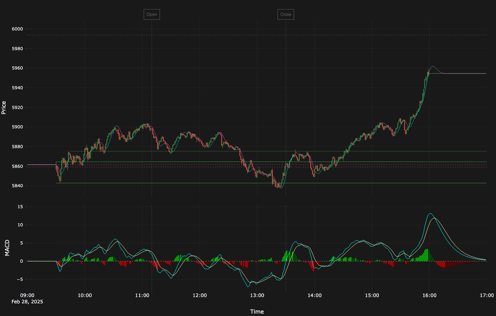

# TastyTrade SDK

A high-performance Python SDK for the TastyTrade Open API, providing programmatic access to trading operations and real-time market data with advanced analytics capabilities.




## 🚀 Features

### Core Trading Features
- Trade execution and position management
- Advanced order types support
- Real-time position monitoring
- Options chain data access
- Risk metrics tracking
- Support for stocks and options (futures and crypto planned)

### 📊 Real-Time Data Processing
- High-performance DXLink client:
  - Handles WebSocket connection management
  - Real-time market data stream processing
  - Event normalization and type safety
  - Advanced subscription management
  - Automatic reconnection and error handling
- Robust data pipeline:
  - Telegraf as data routing backbone:
    - Receives processed events from DXLink client
    - Writes to InfluxDB for time-series storage
    - Streams to Kafka for real-time distribution *(in development)*
    - Provides system metrics and monitoring
  - InfluxDB for historical analysis
  - ~~Kafka~~ Redis for scalable event distribution
- Event processing and analytics:
  - Real-time technical indicators
  - Custom data transformations
  - Configurable event processors
  - Fault-tolerant data flow

### 📈 Analytics

- Real-time technical indicators:
  - Hull Moving Average (HMA)
  - MACD with dynamic color coding
  - Volume analysis (planned)
  - Custom price and time references
- Interactive charting
- Customizable dashboards

### 🔧 Technical Architecture

```
                                   WebSocket Feed
                                         │
                                    ┌──────────┐  Message Parser
                    ┌───────────────│ DXClient │        &
                    │               └──────────┘   Event Router
                    │                    │
                    │                    ▼
                    │               ┌──────────┐
                    │               │ Telegraf │  ──  ──  ──  ─┐
                    │               └──────────┘
                    │                    │                     │
                    ▼                    ▼                     ▼
     pub/sub  ┌──────────┐          ┌──────────┐          ┌──────────┐
        &     │  Redis   │          │ InfluxDB │          │   Kafka  │ (in development)
      cache   └─────┬────┘          └──────────┘          └────┬─────┘
                    │                                          │
                    ▼                                          ▼
    ┌────────┬─────────────┬─────────────┬──────────────┬──────────────────┬──────┐
             │             │             │              │                  │
             ▼             ▼             ▼              ▼                  ▼
    ┌───────────────┐ ┌─────────┐ ┌─────────────┐ ┌────────────┐     ┌────────────┐
    │   Analytics   │ │ Alerts  │ │   Recipes   │ │  Logging   │ ... │    etc     │
    └───────────────┘ └─────────┘ └─────────────┘ └────────────┘     └────────────┘
```

- **Real-time Processing**: WebSocket streaming with asynchronous event handling
- **Data Storage**: InfluxDB for time-series data storage and analysis
- **Message Queue**: ~~Kafka~~ Redis for reliable event distribution
- **Metrics Collection**: Telegraf for system and application metrics
- **Containerization**: Full Docker support with dev containers

## 🛠️ Prerequisites

- VS Code or GitHub Codespaces
- Docker Desktop
- Git

## 📦 Installation

The TastyTrade SDK is designed to run in a development container that provides a consistent, pre-configured environment with all necessary dependencies and services.

### Option 1: VS Code (Recommended)

1. Clone the repository:
   ```bash
   git clone https://github.com/yourusername/tastytrade_sdk.git
   cd tastytrade_sdk
   ```

2. Install the "Remote - Containers" extension in VS Code:
   - Open VS Code
   - Press `Ctrl+P` (or `Cmd+P` on macOS)
   - Type `ext install ms-vscode-remote.remote-containers`

3. Open in Dev Container:
   - Open the cloned repository in VS Code
   - When prompted "Folder contains a dev container configuration file. Reopen folder to develop in a container?", click "Reopen in Container"
   - Or press `F1`, type "Remote-Containers: Reopen in Container" and press Enter

VS Code will build and start the development container, which includes:
- Python 3.11 environment
- UV (fast Python package manager) for dependency management
- InfluxDB
- Telegraf
- Kafka
- Redis
- Redis-Commander
- All required Python packages
- Pre-configured development tools

### Option 2: GitHub Codespaces

1. Visit the repository on GitHub
2. Click the "Code" button
3. Select "Open with Codespaces"
4. Click "New codespace"

The development environment will be automatically configured with all necessary dependencies.

### Post-Installation Setup

1. Copy the environment template:
   ```bash
   cp .env.example .env
   ```

2. Edit `.env` with your TastyTrade credentials and preferences:
   ```bash
   TASTYTRADE_USERNAME=your_username
   TASTYTRADE_PASSWORD=your_password
   INFLUX_DB_ORG=your_org
   INFLUX_DB_BUCKET=your_bucket
   INFLUX_DB_TOKEN=your_token
   ```

3. Start the infrastructure services:
   ```bash
   docker-compose up -d
   ```

The SDK is now ready to use within the development container!

## Quick Start

### CLI Services

The SDK provides several CLI entry points for streaming and analytics:

```bash
# Start market data subscription (candles, quotes, Greeks → Redis)
uv run tasty-subscription run \
  --symbols AAPL,SPY,QQQ \
  --intervals 1d,1h,5m \
  --start-date 2026-01-20

# Start account stream (positions, balances, orders → Redis)
uv run tasty-subscription account-stream

# View current positions from Redis
uv run tasty-subscription positions

# View position summary by underlying
uv run tasty-subscription positions-summary

# Deterministic strategy classification
uv run tasty-subscription strategies

# Check subscription status
uv run tasty-subscription status

# Signal detection
uv run tasty-signal run --symbols SPY,QQQ

# Backtesting
uv run tasty-backtest run --strategy iron-condor --symbol SPY

# FastAPI server
uv run api
```

### Justfile Recipes

Common operations are available via [just](https://github.com/casey/just):

```bash
just subscribe          # Market data subscription (defaults to prior workday)
just account-stream     # Account stream (positions/balances/orders to Redis)
just positions          # Show current position metrics
just positions-summary  # Aggregated position summary by underlying
just strategies         # Deterministic strategy classification
just status             # Check subscription status
```

## Data Processing Pipeline

### Market Data Flow
1. Real-time data ingestion via WebSocket (DXLink for market data, Account Streamer for account state)
2. Event processing and normalization
3. Storage in Redis HSET for latest state and pub/sub for real-time distribution
4. Storage in InfluxDB for historical analysis
5. Analytics, strategy classification, and signal detection

## 🔧 Configuration

### Environment Variables
```bash
INFLUX_DB_ORG=your_org
INFLUX_DB_BUCKET=your_bucket
INFLUX_DB_TOKEN=your_token
```

### Docker Services
- InfluxDB (Port 8086)
- Telegraf (Port 8186)
- Redis (Port 6379)
- Grafana (Port 3000)

## 🧪 Development

### Dev Container Features
- Pre-configured Python 3.11 environment
- All dependencies pre-installed
- Integrated debugging support
- Pre-configured linting and formatting
- Automatic infrastructure service management
- Consistent development experience across machines

### Dependency Management (UV)

This project uses [uv](https://github.com/astral-sh/uv) instead of Poetry.

Install uv (if not already installed):
```bash
curl -LsSf https://astral.sh/uv/install.sh | sh
```

Sync (install) dependencies (inside repo root):
```bash
uv sync
```

Add a runtime dependency:
```bash
uv add some-package
```

Add a dev-only dependency:
```bash
uv add --dev some-dev-package
```

Update all dependencies (respecting version constraints):
```bash
uv lock --upgrade
uv sync
```

Run a command in the project environment:
```bash
uv run python -m tastytrade --help
```

### Running Tests
```bash
uv run pytest
```

### Code Quality
```bash
uv run ruff check .
uv run pyright
```

## 📚 Documentation

Detailed documentation is available in the `/docs` directory:
- API Reference
- Architecture Guide
- Development Guide
- Deployment Guide

## 🤝 Contributing

1. Fork the repository
2. Create a feature branch (`git checkout -b feature/amazing_feature`)
3. Commit your changes (`git commit -m 'Add amazing feature'`)
4. Push to the branch (`git push origin feature/amazing_feature`)
5. Open a Pull Request

## 📝 License

This project is licensed under the MIT License - see the [LICENSE](LICENSE) file for details.

## 🙏 Support

For issues and questions, please [open a GitHub issue](https://github.com/yourusername/tastytrade_sdk/issues).
