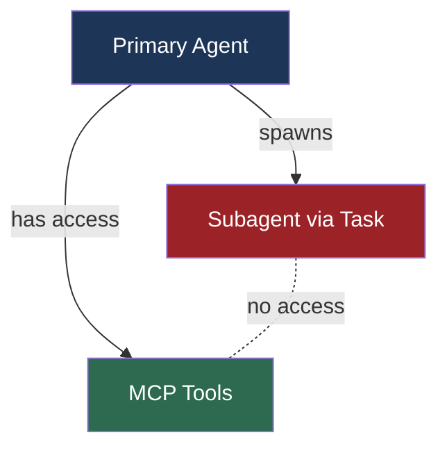
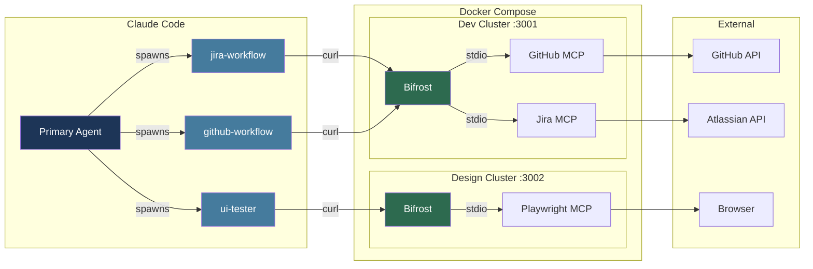
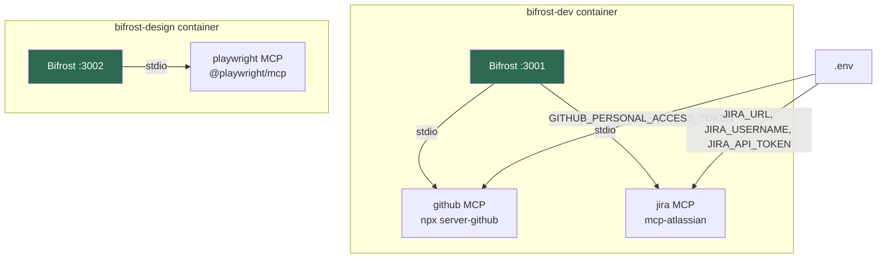
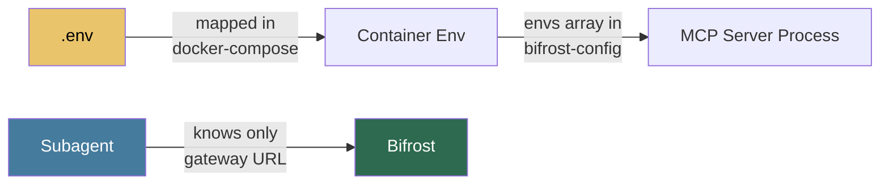
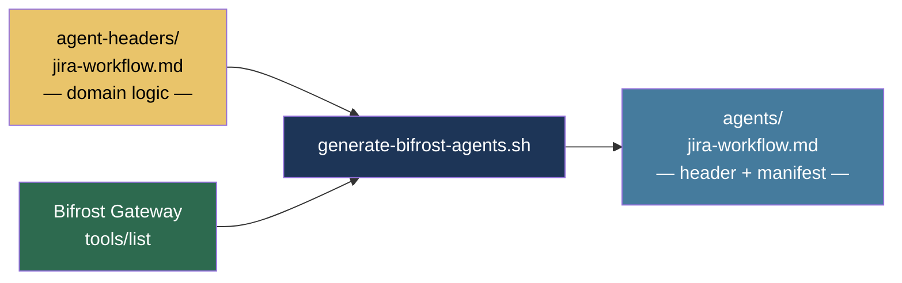
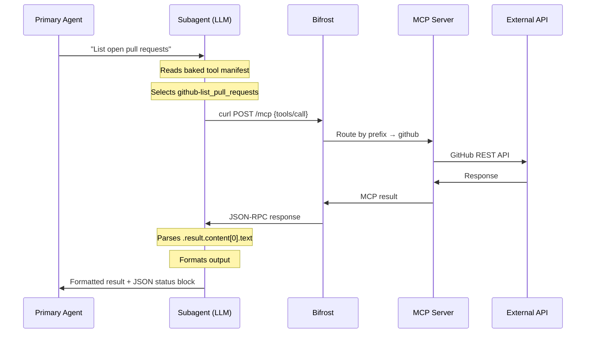
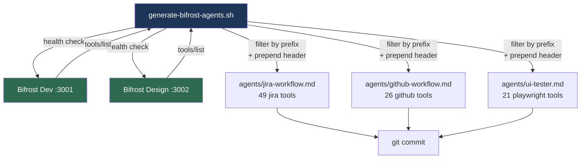
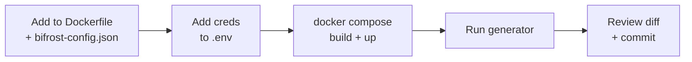

# Agentic Configuration

This document describes how Claude Code subagents access external tools through the Bifrost MCP gateway. It covers the infrastructure, agent definitions, the generator workflow, and operational procedures.

For the design rationale and architecture decisions, see [docs/requirements/TT-106-mcp-subagent-architecture.md](requirements/TT-106-mcp-subagent-architecture.md).

---

## Problem

Claude Code subagents cannot access MCP tools registered in the parent session. This is a platform-level bug — subagents spawned via the `Task` tool have no MCP runtime. Without a workaround, every external integration (Jira, GitHub, Playwright) requires hand-rolled shell scripts, capping adoption at a few integrations.



## Solution

MCP servers run as containerized services behind [Bifrost](https://github.com/MaximHQ/bifrost), an open-source MCP gateway. Subagents call the gateway over HTTP via curl. From the subagent's perspective, the gateway is just a REST API — no MCP client knowledge required.



---

## Infrastructure

### Gateway Clusters

MCP servers are grouped into logical clusters, one Bifrost instance per cluster. Each cluster is a single Docker image that bundles Bifrost + all STDIO MCP servers for that domain.

| Cluster | Port | MCP Servers | Docker Image |
|---------|------|-------------|--------------|
| Dev | 3001 | GitHub (`@modelcontextprotocol/server-github`), Jira (`mcp-atlassian`) | `docker/bifrost-dev/` |
| Design | 3002 | Playwright (`@playwright/mcp`) | `docker/bifrost-design/` |



### Docker Compose

Both clusters run as services in the project's `docker-compose.yml`:

```yaml
bifrost-dev:
  build: ./docker/bifrost-dev
  ports: ["3001:8080"]
  environment:
    - GITHUB_PERSONAL_ACCESS_TOKEN=${GITHUB_PERSONAL_ACCESS_TOKEN}
    - JIRA_URL=${ATLASSIAN_SITE_NAME}
    - JIRA_USERNAME=${ATLASSIAN_USER_EMAIL}
    - JIRA_API_TOKEN=${ATLASSIAN_API_TOKEN}
  healthcheck:
    test: ["CMD", "wget", "--no-verbose", "--tries=1", "-O", "/dev/null",
           "http://localhost:8080/health"]

bifrost-design:
  build: ./docker/bifrost-design
  ports: ["3002:8080"]
  extra_hosts: ["host.docker.internal:host-gateway"]
  healthcheck: ...
```

### Bifrost Configuration

Each cluster has a `bifrost-config.json` that registers MCP servers as STDIO clients:

```json
{
  "mcp": {
    "client_configs": [
      {
        "name": "github",
        "connection_type": "stdio",
        "stdio_config": {
          "command": "npx",
          "args": ["-y", "@modelcontextprotocol/server-github"],
          "envs": ["GITHUB_PERSONAL_ACCESS_TOKEN"]
        },
        "is_ping_available": true,
        "tools_to_execute": ["*"]
      }
    ]
  }
}
```

Bifrost automatically namespaces tools with the client name: `github-create_issue`, `jira-jira_search`, `playwright-browser_navigate`.

### Credentials

Credentials flow from `.env` → docker-compose environment → Bifrost container → STDIO MCP server process. Each MCP server only receives the credentials it needs. Subagent definitions contain no secrets.



---

## Agent Definitions

### Structure

Each agent is composed of two parts:

1. **Hand-maintained header** (`.claude/agent-headers/<name>.md`) — domain-specific workflow logic, QA checklists, conventions, spec references. Edited by humans.

2. **Generated tool manifest** — tool names, descriptions, JSON schemas, invocation pattern, response contract. Produced by the generator script from a live gateway.

The generator combines header + manifest into the final `.claude/agents/<name>.md` file.



### Current Agents

| Agent | Header | Tools | Gateway |
|-------|--------|-------|---------|
| `jira-workflow` | Jira workflow logic, hierarchical retrieval, QA checklists | 49 Jira tools | :3001 |
| `github-workflow` | PR standards, branch enforcement, QA verification | 26 GitHub tools | :3001 |
| `ui-tester` | Browser testing workflow, screenshot handling | 21 Playwright tools | :3002 |

### Invocation Pattern

All agents call tools via the same curl pattern:

```bash
RESULT=$(curl -sf -X POST "http://localhost:3001/mcp" \
  -H "Content-Type: application/json" \
  -d '{"jsonrpc":"2.0","id":1,"method":"tools/call","params":{"name":"TOOL_NAME","arguments":{...}}}')
echo "$RESULT" | jq -r '.result.content[0].text // .error.message'
```

### Runtime Flow



### Response Contract

Agents end their response with a JSON status block:

```json
{"status": "success", "tools_called": ["github-list_pull_requests"], "summary": "..."}
```

This is best-effort enrichment. The primary agent reasons over the full text if the JSON block is absent.

### Delegation Rules

The primary agent's CLAUDE.md includes delegation rules: "Tell the agent WHAT to do, not HOW." The primary agent should not prescribe `gh` commands, curl calls, or specific tools. The subagent has its own tool manifest and decides how to execute.

---

## Generator Script

`scripts/generate-bifrost-agents.sh` queries live Bifrost gateways and produces agent definitions.

### Usage

```bash
# Generate all agents
BIFROST_DEV_URL=http://localhost:3001 \
BIFROST_DESIGN_URL=http://localhost:3002 \
bash scripts/generate-bifrost-agents.sh

# List available tools by prefix
BIFROST_DEV_URL=http://localhost:3001 \
BIFROST_DESIGN_URL=http://localhost:3002 \
bash scripts/generate-bifrost-agents.sh --list-tools
```

### How It Works



Steps:
1. Reads the agent registry (name, gateway URL, tool prefix, transport mode)
2. Health-checks each gateway
3. Calls `tools/list` via JSON-RPC to get the full tool manifest
4. Filters tools by prefix (e.g., `jira` tools for jira-workflow)
5. Prepends the hand-maintained header from `.claude/agent-headers/`
6. Writes the combined output to `.claude/agents/`

### When to Regenerate

Run the generator when:
- An MCP server is added or removed from a cluster
- An MCP server's tools change (new tool, removed tool, schema change)
- A hand-maintained header is updated

The diff in `.claude/agents/` makes changes auditable. Commit the regenerated files alongside the config change.

---

## Operational Procedures

### Starting the Gateways

```bash
docker compose up -d bifrost-dev bifrost-design
```

Verify health:
```bash
docker compose ps bifrost-dev bifrost-design
```

Both should show `(healthy)` status.

### Adding a New MCP Server to an Existing Cluster



1. Add the runtime dependency to the cluster's `docker/bifrost-<cluster>/Dockerfile`
2. Add the STDIO config entry to `docker/bifrost-<cluster>/bifrost-config.json`
3. Add credentials to `.env` and map them in `docker-compose.yml`
4. Rebuild: `docker compose build bifrost-<cluster>`
5. Restart: `docker compose up -d bifrost-<cluster>`
6. Regenerate agents: `bash scripts/generate-bifrost-agents.sh`
7. Review diff in `.claude/agents/` and commit

### Adding a New Gateway Cluster

1. Create `docker/bifrost-<cluster>/` with Dockerfile and config
2. Add the service to `docker-compose.yml` on a new port with healthcheck
3. Add the cluster URL environment variable
4. Add agent entries to the `AGENTS` array in `scripts/generate-bifrost-agents.sh`
5. Create a header file in `.claude/agent-headers/`
6. Run the generator and commit

### Adding a New Agent to an Existing Cluster

1. Add an entry to the `AGENTS` array in `scripts/generate-bifrost-agents.sh`
2. Create a header in `.claude/agent-headers/<name>.md`
3. Run the generator
4. Update CLAUDE.md delegation rules if needed
5. Commit

### Troubleshooting

**Gateway not healthy:**
```bash
docker logs bifrost-dev 2>&1 | tail -20
curl -s http://localhost:3001/health | jq
```

**MCP server not connecting:**
Check Bifrost logs for `Connected to MCP server '<name>'`. If missing, verify the config entry and that the MCP server binary is installed in the Docker image.

**Tool call failing:**
```bash
# Test directly
curl -sf -X POST "http://localhost:3001/mcp" \
  -H "Content-Type: application/json" \
  -d '{"jsonrpc":"2.0","id":1,"method":"tools/list"}' | jq '[.result.tools[].name]'
```

**Response too large:**
Add `per_page` limits to list operations in the agent header's guidance section.

---

## File Reference

```
.claude/
  agent-headers/           # Hand-maintained domain logic (human-edited)
    jira-workflow.md
    github-workflow.md
    ui-tester.md
  agents/                  # Generated agent definitions (header + manifest)
    jira-workflow.md
    github-workflow.md
    ui-tester.md

docker/
  bifrost-dev/             # Dev cluster (GitHub + Jira)
    Dockerfile
    bifrost-config.json
  bifrost-design/          # Design cluster (Playwright)
    Dockerfile
    bifrost-config.json

scripts/
  generate-bifrost-agents.sh   # Agent generator

docs/
  AGENTIC_CONFIGURATION.md          # This document
  requirements/
    TT-106-mcp-subagent-architecture.md   # Design spec (v1.3)
    TT-106-bifrost-validation-findings.md  # Gate validation results
    TT-106-github-capability-comparison.md # MCP vs skill scripts diff
```
