# MCP Subagent Architecture Design Spec

**Version:** 1.3
**Status:** Design

---

## 1. Problem Statement

### 1.1 The Bug

Claude Code subagents spawned via the `Task` tool cannot access MCP tools registered in the parent session. This is a platform-level bug in Claude Code's internal wiring, not a limitation of the MCP protocol itself.

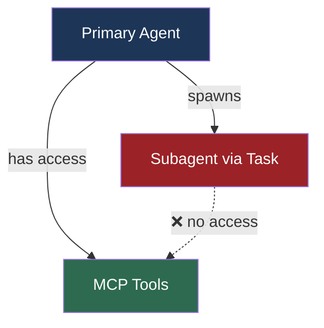

### 1.2 Rationale for Not Waiting on the Bug Fix

The bug is tracked and closed as a duplicate on GitHub, indicating Anthropic is aware. However:

- No fix timeline is public
- Production workflows cannot depend on an unfixed platform bug
- The workaround we design here is architecturally superior regardless — it removes Claude Code's MCP runtime from the critical path entirely

---

## 2. Solution Overview

Bypass Claude Code's MCP wiring entirely. Run MCP servers as persistent containerized services behind a gateway. Subagents communicate with the gateway directly over HTTP — no MCP runtime involvement required.

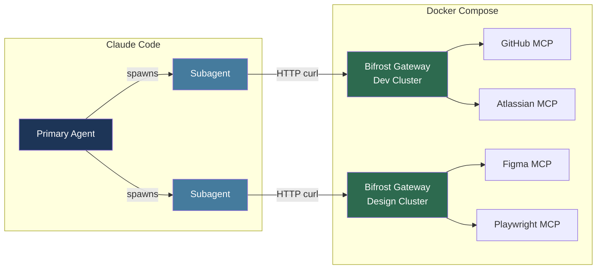

**Key principle:** From the subagent's perspective, the gateway is just an HTTP API. No MCP client knowledge required at runtime.

---

## 3. Architecture Decisions

### 3.1 Gateway: Bifrost

**Decision:** Use Bifrost as the MCP multiplexer/gateway.

**Rationale:**

- Open source, self-hosted — no vendor dependency
- Acts as both MCP client (connects to MCP servers) and MCP server (exposes unified endpoint)
- Aggregates `tools/list` across all connected MCP servers natively
- Routes `tools/call` to the correct MCP server transparently
- Single `/mcp` endpoint per gateway instance — aligns exactly with the per-cluster architecture
- Runs as a standard Docker container — fits directly into existing docker-compose

**Rejected alternatives:**

| Option | Reason Rejected |
|---|---|
| Docker MCP Gateway | No built-in routing/multiplexing; requires manual routing layer |
| Kong AI Gateway | Enterprise pricing; heavyweight for this use case |
| Composio | Managed SaaS; credentials leave your environment |
| Custom multiplexer | Build vs buy — Bifrost already solves this |

---

### 3.2 Deployment: Docker Compose

**Decision:** All MCP servers and Bifrost gateways run as services in the project's existing docker-compose stack.

**Rationale:**

- No new infrastructure patterns
- Credential management via docker-compose environment variables — credentials never leave the container
- Service discovery within compose network is trivial (service name as hostname)
- Lifecycle managed by compose — services start together, restart on failure

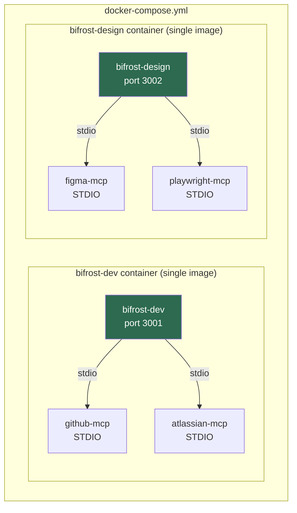

---

### 3.3 Gateway Clustering

**Decision:** Group MCP servers into logical clusters, one Bifrost instance per cluster.

**Rationale:**

- Subagents are purpose-built for specific domains — a code review subagent doesn't need Figma tools
- Smaller tool manifests per subagent = less context window pressure
- Independent scaling and restart per cluster
- Tool namespacing within a cluster remains unambiguous

**Example clusters:**

| Cluster | MCPs | Primary consumers |
|---|---|---|
| Dev | GitHub, Atlassian | Code, PR, ticket subagents |
| Design | Figma, Playwright | UI review, visual testing subagents |
| Data | (future) | Analytics subagents |

---

### 3.4 Tool Namespacing

**Decision:** Bifrost prefixes all aggregated tools with the originating MCP server name.

**Rationale:** Two MCP servers behind the same gateway could expose identically named tools (e.g. both GitHub and Atlassian have a `create_issue` concept). Namespacing makes collisions impossible and routing trivial.

**Convention mirrors Claude Code itself:**

```
`mcp__github__create_issue`
`mcp__atlassian__create_issue`
`mcp__figma__get_file`
`mcp__playwright__screenshot`
```

Routing a `tools/call` back to the correct MCP: strip the prefix, match to the originating server, forward.

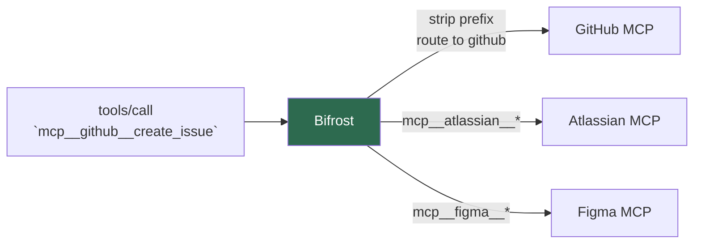

---

### 3.5 Credential Management

**Decision:** Credentials live in the docker-compose environment, scoped per MCP container.

**Rationale:**

- Credentials never leave the docker network
- Each MCP service only receives the credentials it needs (least privilege)
- Subagents inherit env vars from the Claude Code session for gateway URLs and any shared keys — no secrets are baked into subagent definitions

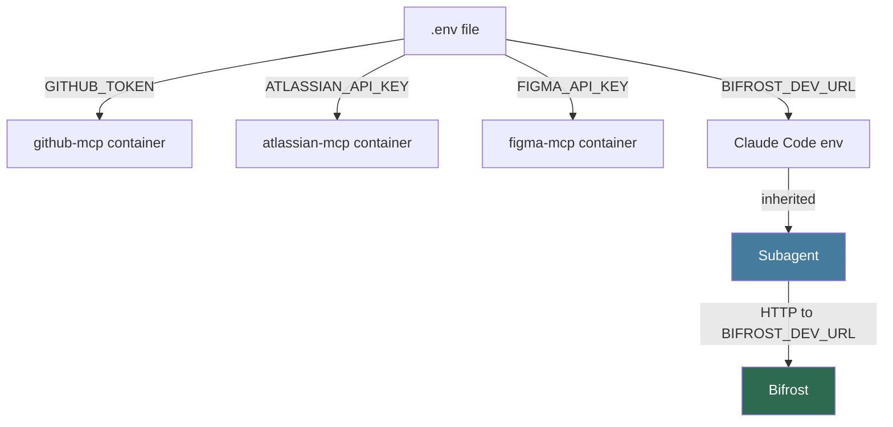

---

### 3.6 STDIO MCP Server Strategy

**Decision:** Bundle all STDIO-based MCP servers into a single custom Bifrost Docker image. Do not use separate STDIO-to-HTTP wrapper containers.

**Rationale:**

- Most community MCP servers use STDIO transport, not HTTP/SSE
- Bifrost natively supports STDIO connections — no wrapper needed
- A single image eliminates per-MCP-server container sprawl and inter-container network hops
- One Dockerfile, one build, one versioned artifact per cluster
- Adding an MCP server means adding its runtime dependency to the Dockerfile and rebuilding

**Bifrost STDIO configuration format:**

```json
{
  "name": "github",
  "connection_type": "stdio",
  "stdio_config": {
    "command": "npx",
    "args": ["-y", "@modelcontextprotocol/server-github"],
    "envs": ["GITHUB_TOKEN"]
  },
  "tools_to_execute": ["*"]
}
```

**Dockerfile pattern (per cluster):**

```dockerfile
FROM ghcr.io/maximhq/bifrost:latest

# Install runtimes needed by STDIO MCP servers
RUN apt-get update && apt-get install -y nodejs npm python3 python3-pip
RUN npm install -g npx

# Pre-cache MCP server packages to avoid runtime downloads
RUN npx -y @modelcontextprotocol/server-github --help || true
RUN npx -y @modelcontextprotocol/server-atlassian --help || true

COPY bifrost-config.json /etc/bifrost/config.json
```

**Escape hatch:** If two MCP servers have conflicting system dependencies (e.g., incompatible Node versions), extract the conflicting server into a standalone container and connect to it via SSE. This should be the exception, not the default.

---

### 3.7 Gateway Health Checks

**Decision:** Bifrost gateway containers declare a Docker healthcheck. This is a lightweight defensive measure, not a critical path concern.

**Context:** In the devcontainer-adjacent deployment, Bifrost and Claude Code share the same compose stack. The gateway is typically already healthy before any subagent interaction occurs. The healthcheck exists to handle cold-start ordering during `docker compose up` and to surface container failures in `docker compose ps`.

**Docker Compose healthcheck:**

```yaml
bifrost-dev:
  build: ./docker/bifrost-dev
  ports:
    - "3001:3001"
  healthcheck:
    test: ["CMD", "curl", "-f", "http://localhost:3001/health"]
    interval: 10s
    timeout: 5s
    retries: 3
    start_period: 5s
```

---

## 4. Subagent Tool Manifest

### 4.1 The Problem with Fully Static vs Fully Dynamic

| Approach                            | Problem                                             |
| ----------------------------------- | --------------------------------------------------- |
| Fully hardcoded                     | Breaks silently when tools change                   |
| Fully dynamic (discover at runtime) | Slow, fragile, burns context on every invocation    |
| **Generated and baked (chosen)**    | **Fast, reliable, explicit — regenerate on change** |

### 4.2 Generator Script

A script (~80 lines, bash or Python) that:

1. Waits for each Bifrost gateway to be healthy
2. Hits each gateway's `tools/list` via JSON-RPC
3. Aggregates the namespaced tool manifest
4. Writes a fully formed subagent `.md` file into `.claude/agents/`
5. Commits alongside the codebase

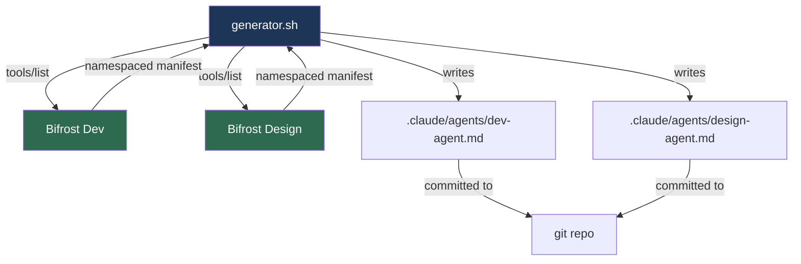

**When to regenerate:** When an MCP server behind a gateway adds, removes, or changes a tool. The diff in the generated subagent file makes changes auditable.

**Generator discovery call:**

```bash
curl -s -X POST "$BIFROST_DEV_URL/mcp" \
  -H "Content-Type: application/json" \
  -d '{"jsonrpc":"2.0","id":1,"method":"tools/list"}' \
  | jq '.result.tools'
```

**Output per tool:** The generator inlines the full JSON schema for each tool. This costs context window tokens but ensures the subagent has precise type information to construct valid calls without guessing. Tool names containing double underscores (e.g., `mcp__github__create_issue`) must be backtick-fenced in the generated markdown to prevent rendering as bold text.

### 4.3 Manifest Structure in Subagent

The baked manifest in the subagent system prompt contains per tool:

- Namespaced tool name
- Description
- Full JSON input schema (required and optional fields, types, constraints)
- Which gateway endpoint to call
- Transport mode (stateless / stateful)

**Example generated tool entry:**

```markdown
### `mcp__github__create_issue`

Description: Create a new GitHub issue in a repository
Gateway: $BIFROST_DEV_URL
Transport: stateless
Schema:
Required: owner (string), repo (string), title (string)
Optional: body (string), labels (array of strings), assignees (array of strings)
Input schema (full):
{
"type": "object",
"properties": {
"owner": {"type": "string", "description": "Repository owner"},
"repo": {"type": "string", "description": "Repository name"},
"title": {"type": "string", "description": "Issue title"},
"body": {"type": "string", "description": "Issue body markdown"},
"labels": {"type": "array", "items": {"type": "string"}},
"assignees": {"type": "array", "items": {"type": "string"}}
},
"required": ["owner", "repo", "title"]
}
```

---

## 5. Runtime Invocation Layer

### 5.1 Transport Modes

Two transport modes are supported: stateless and stateful. The generator detects which mode a gateway's MCP servers require and bakes the correct invocation pattern into the subagent.

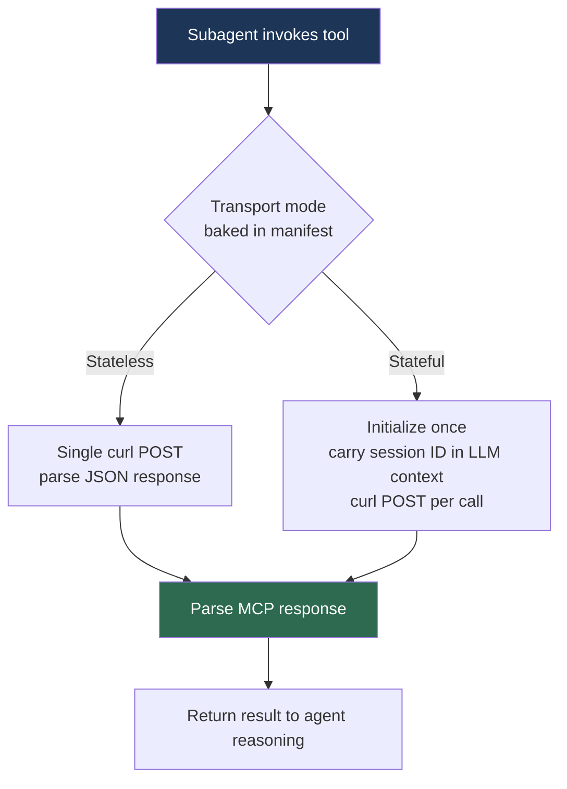

### 5.2 Stateless Invocation

For MCP servers that require no session state between calls.

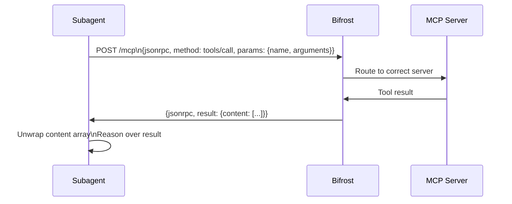

### 5.3 Stateful Invocation

For MCP servers that manage state across calls — e.g., Playwright MCP maintains a browser context where you navigate, then interact, then screenshot against the same session.

**Decision:** Session IDs are carried through the LLM's conversation context. No tmp files. The subagent reads the session ID from one Bash call's output and writes it as a literal string into the next Bash call's curl command.

**How it works:**

1. Subagent executes a Bash call to `initialize`. The response includes a session ID.
2. The subagent (as an LLM) sees the session ID in the Bash output. It reasons about the result and decides what to do next.
3. On the next Bash call, the subagent writes the session ID as a literal string in the `Mcp-Session-Id` header. It already knows the value — it's in the conversation.

The state lives in the LLM's context window, not the file system.

**Example — Playwright workflow via Bifrost:**

```bash
# Bash call 1: Initialize session
curl -s -X POST "$BIFROST_DESIGN_URL/mcp" \
  -H "Content-Type: application/json" \
  -d '{"jsonrpc":"2.0","id":1,"method":"initialize","params":{"clientInfo":{"name":"subagent"}}}'
# Output: {"result":{"sessionId":"sess-7f3a","capabilities":{...}}}
```

Subagent reads `sess-7f3a` from output, sends `initialized`, then navigates:

```bash
# Bash call 2: Notify initialized + navigate
curl -s -X POST "$BIFROST_DESIGN_URL/mcp" \
  -H "Content-Type: application/json" \
  -H "Mcp-Session-Id: sess-7f3a" \
  -d '{"jsonrpc":"2.0","id":2,"method":"notifications/initialized"}'

curl -s -X POST "$BIFROST_DESIGN_URL/mcp" \
  -H "Content-Type: application/json" \
  -H "Mcp-Session-Id: sess-7f3a" \
  -d '{"jsonrpc":"2.0","id":3,"method":"tools/call","params":{"name":"mcp__playwright__navigate","arguments":{"url":"http://localhost:3000"}}}'
```

Subagent reasons over the navigation result, decides to take a screenshot:

```bash
# Bash call 3: Screenshot (same session — same browser context)
curl -s -X POST "$BIFROST_DESIGN_URL/mcp" \
  -H "Content-Type: application/json" \
  -H "Mcp-Session-Id: sess-7f3a" \
  -d '{"jsonrpc":"2.0","id":4,"method":"tools/call","params":{"name":"mcp__playwright__screenshot","arguments":{}}}'
```

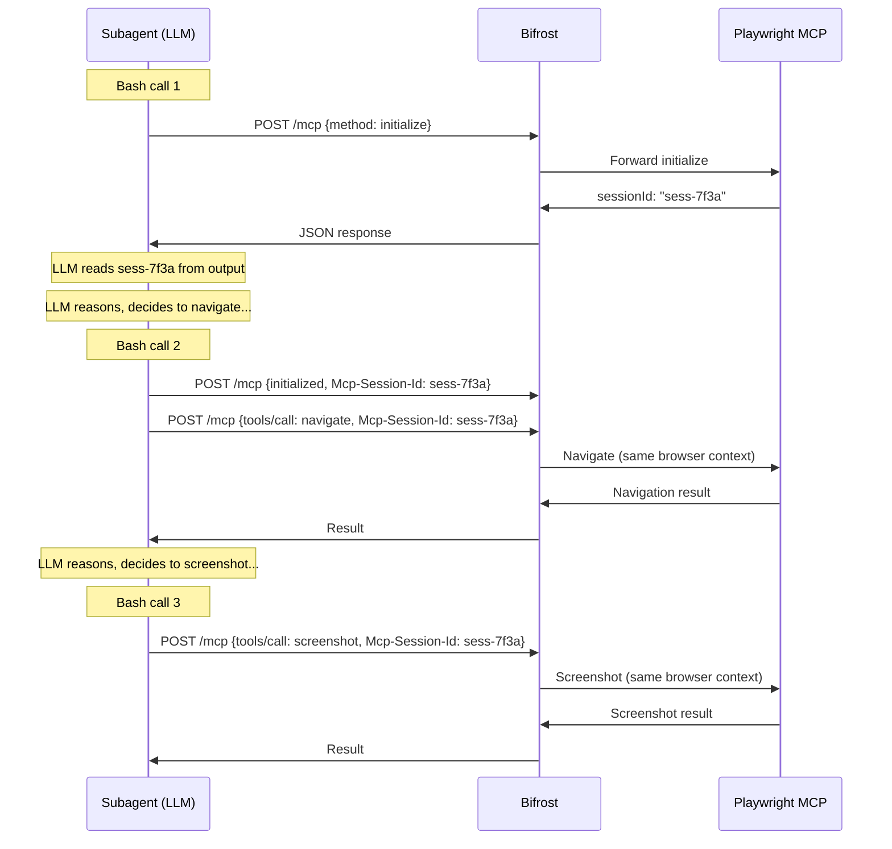

**Generator responsibility:** For stateful gateways, the generator bakes instructions into the subagent definition to: (a) initialize the session on first interaction, (b) extract the session ID from the response, (c) include it as `Mcp-Session-Id` header on all subsequent calls to that gateway.

### 5.4 Response Parsing

MCP wraps all results in a typed content array. The subagent skill encodes how to unwrap it.

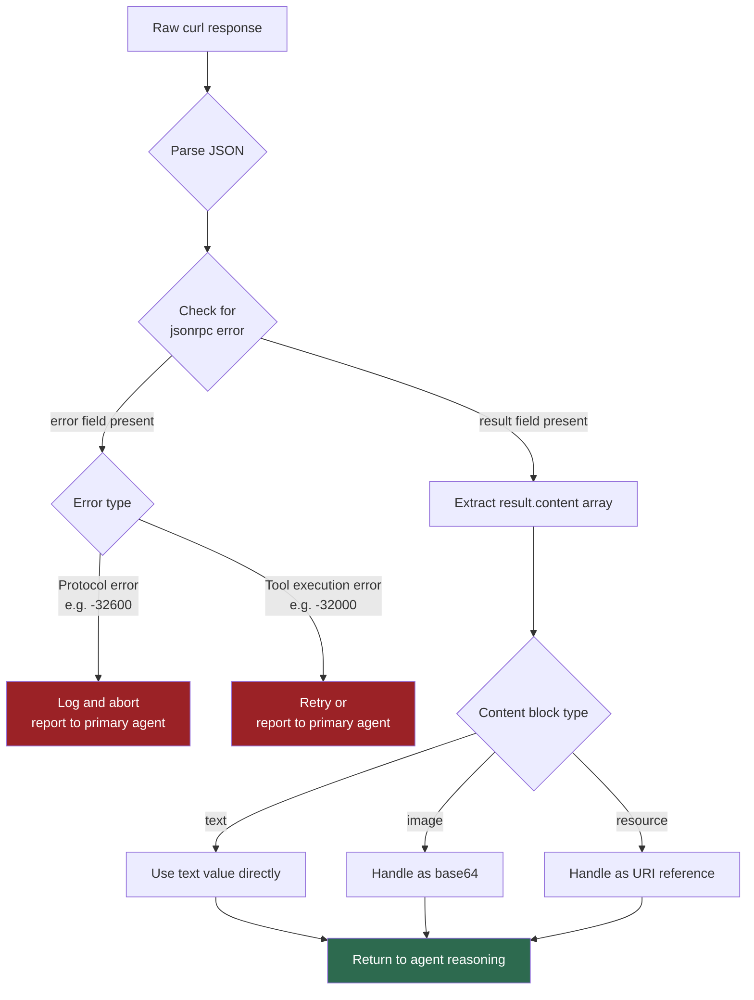

---

### 5.5 Error Escalation Protocol

Subagents return a single free-text message to the primary agent. There is no structured error channel — the primary agent only sees whatever the subagent outputs as its final response. Error escalation must therefore be encoded as a convention in both the subagent and primary agent definitions.

**Decision:** All subagents must end their final response with a structured JSON status block. The primary agent's prompt must include instructions to parse this block.

**Response contract:**

On success:

```json
{
  "status": "success",
  "tools_called": ["mcp__github__create_issue"],
  "summary": "Created issue #42 in owner/repo"
}
```

On tool execution error:

```json
{
  "status": "error",
  "error_type": "execution",
  "tool": "mcp__github__create_issue",
  "detail": "Repository not found: owner/repo"
}
```

On gateway/transport error:

```json
{
  "status": "error",
  "error_type": "gateway_timeout",
  "detail": "Bifrost gateway not ready after 30s"
}
```

On protocol error:

```json
{
  "status": "error",
  "error_type": "protocol",
  "code": -32600,
  "detail": "Invalid JSON-RPC request"
}
```

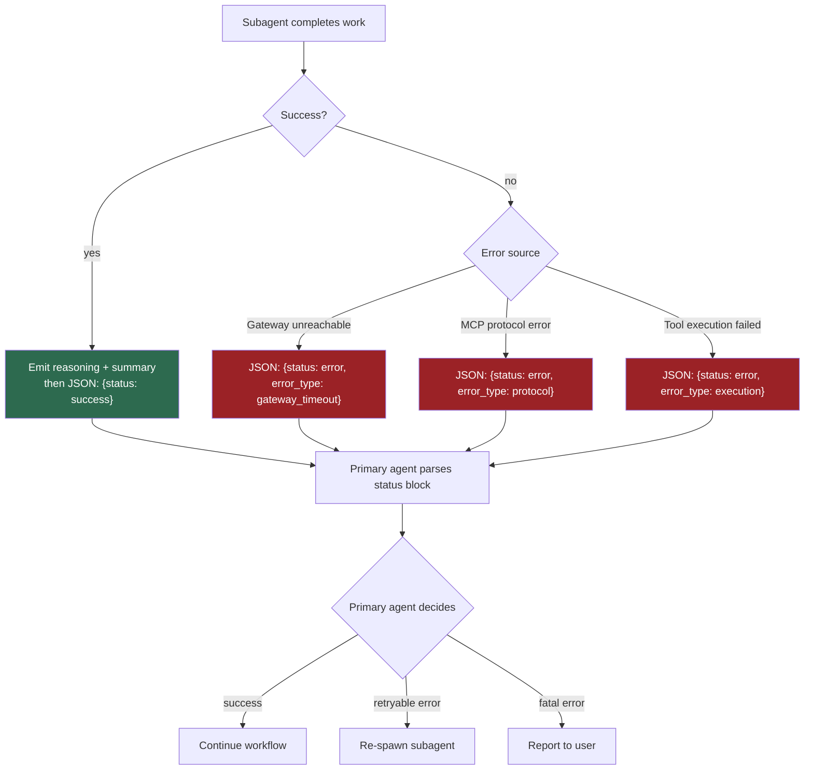

**Graceful degradation:** The response contract is best-effort enrichment, not a hard dependency. The primary agent's parsing instructions must include: "If the trailing JSON status block is absent, reason over the full text response." LLMs will produce the block reliably in most cases, but the primary agent must not break when they don't.

**Generator responsibility:** The generator bakes the response contract into every subagent definition. The primary agent's `CLAUDE.md` or agent definition must include parsing instructions for the trailing JSON block, including the graceful degradation fallback.

---

## 6. Full System Architecture

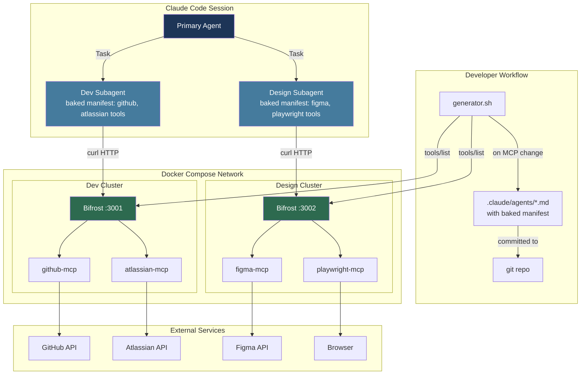

---

## 7. Subagent Definition Structure

```
.claude/agents/dev-agent.md
```

````markdown
---
name: dev-agent
description: Handles GitHub and Atlassian operations via Bifrost gateway
tools: Bash
---

## Gateway

- URL: $BIFROST_DEV_URL (from environment)
- Transport: stateless

## Available Tools

### `mcp__github__create_issue`

Description: Create a new GitHub issue in a repository
Schema:
Required: owner (string), repo (string), title (string)
Optional: body (string), labels (array of strings), assignees (array of strings)
Input schema (full):
{
"type": "object",
"properties": {
"owner": {"type": "string"},
"repo": {"type": "string"},
"title": {"type": "string"},
"body": {"type": "string"},
"labels": {"type": "array", "items": {"type": "string"}},
"assignees": {"type": "array", "items": {"type": "string"}}
},
"required": ["owner", "repo", "title"]
}

### `mcp__github__list_prs`

[generated]

### `mcp__atlassian__create_issue`

[generated]

## Invocation Pattern (stateless)

```bash
RESULT=$(curl -s -X POST "$BIFROST_DEV_URL/mcp" \
  -H "Content-Type: application/json" \
  -d '{"jsonrpc":"2.0","id":1,"method":"tools/call","params":{"name":"TOOL_NAME","arguments":{ARGS}}}')
echo "$RESULT" | jq -r '.result.content[0].text // .error.message'
```

## Response Handling

1. Parse JSON response
2. If `.error` field present: report as error in status block
3. If `.result.content` present: extract `.result.content[0].text` for text results
4. For image content blocks: handle as base64
5. For resource content blocks: handle as URI reference

## Response Contract

Always end your final response with a JSON status block:

- Success: `{"status":"success","tools_called":["tool_name"],"summary":"..."}`
- Error: `{"status":"error","error_type":"execution|gateway_timeout|protocol","detail":"..."}`
````

---

## 8. Operational Considerations

### 8.1 When to Regenerate Manifests

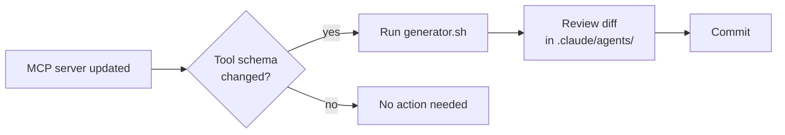

### 8.2 Adding a New MCP Server

1. Add the MCP server's runtime dependency to the cluster's Bifrost Dockerfile
2. Add the STDIO config entry to the cluster's `bifrost-config.json`
3. Add credentials to `.env`
4. Rebuild the Bifrost image: `docker compose build bifrost-dev`
5. Restart: `docker compose up -d bifrost-dev`
6. Run `generator.sh` to regenerate the subagent definition
7. Review diff and commit

### 8.3 Adding a New Gateway Cluster

1. Create a new Bifrost Dockerfile and config for the cluster
2. Add the new service to docker-compose on a new port with healthcheck
3. Add cluster URL to Claude Code environment variables
4. Run `generator.sh` to create the new subagent definition
5. Commit

---

## 9. Resolved Items

| Item                                | Resolution                                                                                                                               | Section  |
| ----------------------------------- | ---------------------------------------------------------------------------------------------------------------------------------------- | -------- |
| Bifrost config for STDIO-based MCPs | Single custom Bifrost image with STDIO configs bundled; Bifrost natively supports `connection_type: stdio`                               | 3.6      |
| Stateful session management         | LLM context carry — session ID flows through conversation, no tmp files; required for Playwright and any MCP with cross-call state       | 5.3      |
| Generator script design             | ~80-line script that curls `tools/list`, inlines full JSON schemas, bakes invocation + readiness + response contract into subagent `.md` | 4.2, 4.3 |
| Error escalation protocol           | Structured JSON status block convention at end of every subagent response; primary agent parses trailing JSON                            | 5.5      |
| Gateway readiness                   | Docker Compose healthcheck for cold-start ordering; no subagent-level gate needed in devcontainer-adjacent deployment                    | 3.7      |

## 10. Remaining Open Items

| Item                                                                                                                   | Status          |
| ---------------------------------------------------------------------------------------------------------------------- | --------------- |
| Generator script implementation                                                                                        | To be built     |
| Bifrost base image compatibility — confirm `ghcr.io/maximhq/bifrost:latest` supports STDIO config format as documented | To be validated |
| Primary agent CLAUDE.md — add response contract parsing instructions                                                   | To be written   |
